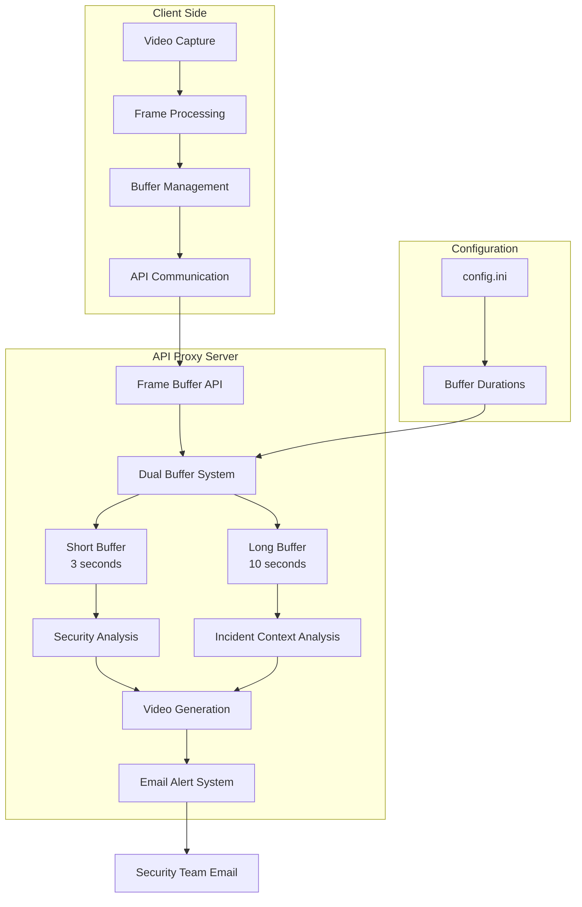

# Design Document

## Overview

The dual buffer video analysis system enhances the existing Vigint security platform with intelligent frame buffering and comprehensive incident detection. The system maintains two distinct frame buffers with configurable durations to optimize both real-time monitoring and detailed incident analysis while generating video evidence for security alerts.

The design builds upon the existing secure client-server architecture where the client application (`vigint/app.py`) captures video frames and the API proxy (`api_proxy.py`) handles all sensitive operations including AI analysis, email notifications, and credential management.

## Architecture

### High-Level Architecture



### Buffer Management Strategy

The system implements a dual buffer approach:

1. **Short Buffer (Monitoring)**: Continuously maintains the last 3 seconds of frames for real-time security incident detection
2. **Long Buffer (Context)**: Maintains the last 10 seconds of frames for detailed incident analysis and video generation

Both buffers use a rolling window approach where new frames automatically replace the oldest frames when capacity is reached.

### Data Flow

1. **Frame Capture**: Client captures video frames from RTSP stream
2. **Buffer Addition**: Each frame is sent to the API proxy and added to the client's buffer
3. **Periodic Analysis**: Every 3 seconds, the short buffer is analyzed for security incidents
4. **Incident Detection**: If a security incident is detected, the long buffer is analyzed for context
5. **Video Generation**: Incident frames from the long buffer are compiled into a video file
6. **Alert Dispatch**: Security alert email is sent with the video attachment

## Components and Interfaces

### 1. Configuration Management

**Location**: `config.ini` - VideoAnalysis section

```ini
[VideoAnalysis]
short_buffer_duration = 3
long_buffer_duration = 10
analysis_fps = 25
video_format = mp4
```

**Interface**:
- `get_buffer_config()`: Returns buffer configuration from config.ini
- `validate_buffer_config()`: Ensures buffer durations are valid (short < long)

### 2. Client-Side Buffer Management

**Location**: `vigint/app.py` - SecureVideoAnalyzer class

**Key Methods**:
- `add_frame_to_buffer(frame)`: Sends frame to API proxy buffer
- `_analyze_frames_async()`: Triggers periodic analysis of recent frames
- `process_video_stream()`: Main video processing loop with buffer integration

**Enhanced Attributes**:
- `short_buffer_duration`: Configurable monitoring window (default: 3 seconds)
- `long_buffer_duration`: Configurable context window (default: 10 seconds)
- `analysis_interval`: Reduced to 3 seconds for more frequent monitoring

### 3. Server-Side Dual Buffer System

**Location**: `api_proxy.py`

**Data Structures**:
```python
# Global frame buffers for each client
client_frame_buffers = {}  # {client_id: deque(maxlen=max_frames)}

# Frame information structure
frame_info = {
    'frame_data': base64_encoded_image,
    'frame_count': integer,
    'timestamp': iso_timestamp
}
```

**Key Functions**:
- `get_client_buffer(client_id)`: Returns or creates client-specific buffer
- `get_short_buffer_frames(client_buffer)`: Extracts last N seconds for monitoring
- `get_long_buffer_frames(client_buffer)`: Extracts last M seconds for context analysis

### 4. Security Analysis Engine

**Location**: `api_proxy.py`

**Enhanced Analysis Pipeline**:
1. **Primary Analysis**: Analyze most recent frame from short buffer
2. **Incident Detection**: Identify security incidents using Gemini AI
3. **Context Analysis**: If incident detected, analyze key frames from long buffer
4. **Risk Assessment**: Determine risk level (LOW, MEDIUM, HIGH)

**Key Functions**:
- `analyze_frame_for_security()`: Enhanced with buffer type parameter
- `analyze_incident_context()`: New function for detailed long buffer analysis
- `extract_key_frames()`: Selects representative frames from long buffer

### 5. Video Generation System

**Location**: `api_proxy.py`

**Video Creation Pipeline**:
1. **Frame Selection**: Use all frames from long buffer during incident window
2. **Video Encoding**: Create MP4 video using OpenCV VideoWriter
3. **Quality Optimization**: Maintain original frame dimensions and configurable FPS
4. **Temporary File Management**: Create, use, and cleanup temporary video files

**Key Functions**:
- `create_video_from_frames()`: Enhanced with configurable FPS and format
- `generate_incident_video()`: New function specifically for security incidents
- `cleanup_temp_files()`: Automatic cleanup of temporary video files

### 6. Enhanced Email Alert System

**Location**: `api_proxy.py`

**Email Enhancement**:
- **Video Attachment**: Automatically attach incident video to security alerts
- **Detailed Context**: Include both initial detection and detailed analysis
- **Metadata**: Add buffer information, frame counts, and incident timeline

**Enhanced Email Structure**:
```
Subject: 🚨 Vigint Security Alert [RISK_LEVEL] - Timestamp
Body:
- Incident summary
- Initial analysis
- Detailed context analysis
- Video attachment information
- Recommended actions
Attachment: security_incident_YYYYMMDD_HHMMSS.mp4
```

## Data Models

### Buffer Configuration Model

```python
@dataclass
class BufferConfig:
    short_buffer_duration: int = 3  # seconds
    long_buffer_duration: int = 10  # seconds
    analysis_fps: int = 25
    video_format: str = "mp4"
    
    def validate(self):
        assert self.short_buffer_duration < self.long_buffer_duration
        assert self.short_buffer_duration > 0
        assert self.analysis_fps > 0
```

### Frame Buffer Model

```python
@dataclass
class FrameInfo:
    frame_data: str  # base64 encoded
    frame_count: int
    timestamp: str  # ISO format
    client_id: int
```

### Analysis Result Model

```python
@dataclass
class SecurityAnalysisResult:
    analysis: str
    has_security_incident: bool
    risk_level: str  # LOW, MEDIUM, HIGH
    timestamp: str
    frame_count: int
    detailed_analysis: Optional[List[Dict]] = None
    incident_frames_count: Optional[int] = None
    video_path: Optional[str] = None
```

## Error Handling

### Buffer Management Errors

1. **Memory Overflow**: Implement buffer size limits and automatic cleanup
2. **Frame Corruption**: Validate base64 encoding and image format
3. **Client Disconnection**: Cleanup client buffers after timeout period

### Video Generation Errors

1. **Encoding Failures**: Fallback to alternative codecs and formats
2. **Insufficient Frames**: Handle cases with fewer frames than expected
3. **Storage Issues**: Implement disk space checks and cleanup policies

### Email Delivery Errors

1. **Attachment Size Limits**: Compress videos or reduce quality if needed
2. **SMTP Failures**: Retry mechanism with exponential backoff
3. **Missing Configuration**: Graceful degradation to text-only alerts

## Testing Strategy

### Unit Tests

1. **Buffer Management Tests**:
   - Test frame addition and removal
   - Verify buffer size limits
   - Test configuration loading

2. **Video Generation Tests**:
   - Test video creation with various frame counts
   - Verify video format and quality
   - Test error handling for corrupted frames

3. **Analysis Pipeline Tests**:
   - Mock Gemini AI responses
   - Test incident detection logic
   - Verify risk level assessment

### Integration Tests

1. **End-to-End Buffer Flow**:
   - Test complete frame capture to analysis pipeline
   - Verify dual buffer coordination
   - Test video generation and email delivery

2. **Configuration Tests**:
   - Test various buffer duration configurations
   - Verify system behavior with invalid configurations
   - Test runtime configuration changes

### Performance Tests

1. **Buffer Performance**:
   - Test memory usage with extended operation
   - Verify frame processing throughput
   - Test concurrent client handling

2. **Video Generation Performance**:
   - Measure video creation time for various buffer sizes
   - Test system performance during video generation
   - Verify no impact on real-time monitoring

### Security Tests

1. **Data Protection**:
   - Verify frame data is properly encoded/decoded
   - Test temporary file cleanup
   - Verify client isolation in multi-client scenarios

2. **API Security**:
   - Test authentication for all new endpoints
   - Verify proper error handling without information leakage
   - Test rate limiting for video generation requests